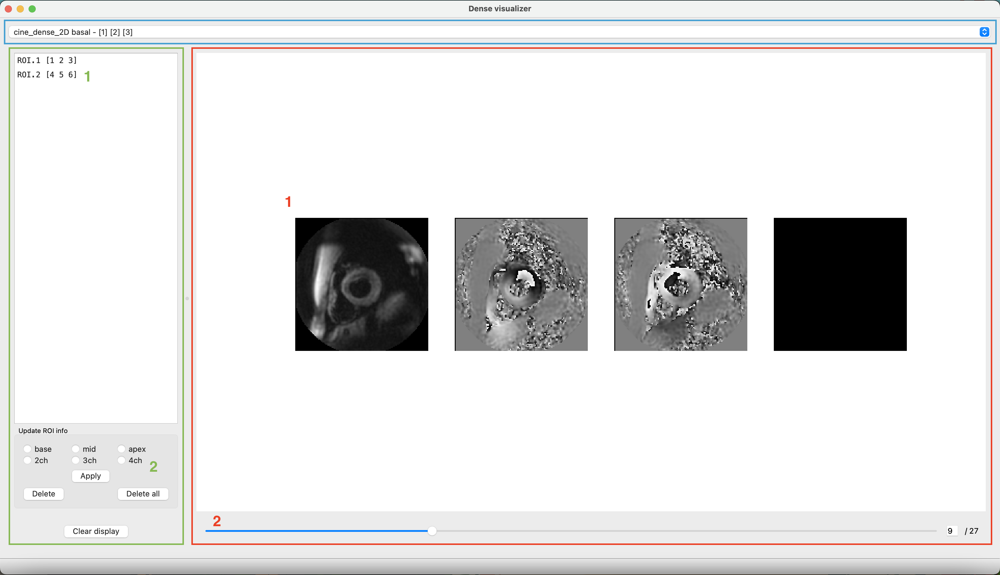
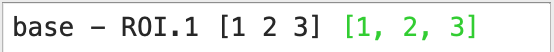

# DENSE-CMR-SegQC

## I. Introduction
We present here a Python application for segmentation Quality-Control on DENSE CMR images. This app is made to be used in conjunction with DENSEanalysis ([https://github.com/denseanalysis/denseanalysis](https://github.com/denseanalysis/denseanalysis)).

Input files for this app should be DENSEanalysis workspaces (generally ```.dns``` files). These files contain DICOM sequences for cine DENSE CMR, of potentially multiple slices/acquisitions. If ROI information is available from the workspaces, they can be loaded on the app and visually assessed. This tool could be extended to support more input format.

By going through an entire dataset, you can validate or update ROI entries, to match them with their corresponding DICOM images, validate the slice location, and discard them if they don't pass quality-control, or if the associated images are not of sufficient quality.

----------

## II. Installation

This app has been tested for ```Python 3.9.7```. You can install the necessary requirements using the ```requirements.txt``` file, for instance using ```pip install -r requirements.txt```.

This app also needs the Matlab engine for Python in order to work properly. This is because the ```.dns``` files are originally created in Matlab, and contain Matlab object references. Updating them using Python alone would fail, that's why ```update_workspace_corrected.m``` is a Matlab function dedicated to update ```.dns``` files correctly.

Matlab engine from the R2021b version is supported. The app might work with other versions, but we cannot guarantee it. If you try other Matlab version, let us know how it works so that we can update the requirements.

To install the engine, you first need to download Matlab. You can do it from the official website: [https://www.mathworks.com/downloads](https://www.mathworks.com/downloads) (select the appropriate version on the left panel). Then, run:
```
cd <matlabroot>/extern/engines/python
python setup.py install
```

If you can't find the root of your Matlab installation, you can find it by running ```matlabroot``` in your Matlab console.

From the R2022 version, you can also install the engine directly from ```pip```:
```
pip install matlabengine
```

> **Warning**
> The R2022 version nor the pip install has been tested for this app. If you try it, let us know how it works!

----------

## II. How it works

Start the app using ```python main.py```. This will start the main GUI (it can take a few seconds to start the first time).

In the main menu, go to ```Files/Open worskspace``` to open a given ```.dns``` file. After having made modifications, you can save the updated file using ```Files/Save workspace```.

> **Warning**
> If you don't want to overwrite the original workspaces, go to ```Utilities/Set output folder``` to specify an output folder different than the original input folder.

When a workspace is loaded, the main GUI gets populated with data:



The GUI is made of three main part:
- blue: toggle between different DICOM slices
- red: image visualizer panel
- green: ROI panel

In the blue section, the current slice name is displayed, along with the indices of the data stored in the ```.dns``` file records(three or four generally, the first one is the index of the magnitude sequence, the two or three others are the indices of the phase sequences).

In the red section, the images (phase and magnitude along x, y and z directions, z might not be available) can be visualized in subsection 1. In subsection 2, we can slide through the frames of the cardiac cycle.

The green section is made for handling ROI information. In subsection 1, the ROI entries found on the workspace are displayed, with their names and associated image indices (to match them with their appropriate DICOMs). By selecting one of the ROI entries, the image panel gets updated with the ROI contours. To unselect a ROI, click the ```Clear display``` button on subsection 2.

Updating the ROI information of the ```.dns``` workspaces happens in subsection 2 of the ROI panel. Once a ROI is selected on a particular DICOM sequence, its information can be updated by selecting the appropriate slice location (base, apex, mid, 2ch, 3ch, 4ch), and clicking ```Apply```. This updates the name of the ROI and the associated images indices:



Upon saving, the updated ROIs will have a new column entry on the workspace, "CorrectedNames" and "CorrectedSeqIndex", with the corresponding updated values.

To discard an update, select a ROI and click ```Delete```. To delete all updates, click ```Delete all```.

After having process all your ```.dns``` files, you can retrieve the ROIs from the workspaces that passed the quality control whenever the "CorrectedNames" and "CorrectedSeqIndex" fields are set, along with the corresponding DICOM sequences.

---------

## III. Attribution and contribution

If you have used this app for your research or it has influenced your work, we ask that you include the following relevant citations in your work:
> Barbaroux, H. (2022). DENSE CMR SegQC. Retrieved from [https://github.com/Hbarbaroux/DENSE-CMR-SegQC](https://github.com/Hbarbaroux/DENSE-CMR-SegQC)

If you have any questions, problems, or if you wish to contribute, you can send an email to hugo.barbaroux@free.fr ([Hugo Barbaroux](https://github.com/Hbarbaroux)). Feel free to submit a pull request as well!


